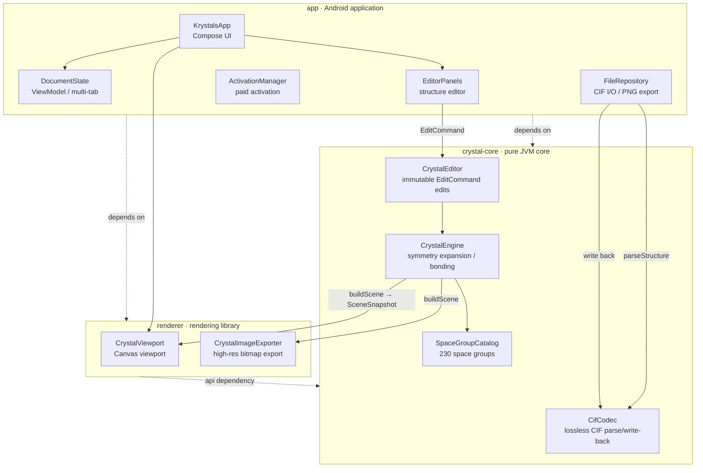

# Krystals


<h3 align="center"> Krystals: A lightweight CIF crystal editor for Android </h3>
  <p align="center">
    View crystals on mobile as conveniently as with VESTA!
    <br />
    <a href="https://github.com/SUPERkelesss/Krystals/releases"> <strong> Download releases </strong> </a> ·
    <a href="https://github.com/SUPERkelesss/Krystals/issues"> Report a bug </a> · 
    <a href="README_cn.md"> 中文版文档 </a> 
  </p>


---

## How to install?

Go to the project's [Release page](https://github.com/SUPERkelesss/Krystals/releases), download the latest package and install it.

## Quick start

The main screen offers four ways to import CIF files:

- **Import local file**: select a CIF file from the file manager and open it.
- **Import from presets**: the app provides a rich preset library covering most basic CIF test cases. You can also save your own CIF files into the presets.
- **Import from online sources**: two options are available — importing from the [Crystallography Open Database](https://qiserver.ugr.es/cod/index.php) and from the [Materials Project](https://next-gen.materialsproject.org/). The latter requires an API key and is a premium feature unlocked with an activation code after sponsoring. The former has no usage restrictions.
- **Create new file**: start creating a CIF document from an empty file.

**Main screen**:


- ① Menu options, including file creation and save operations;
- ② Change overall appearance settings and toggle light/dark themes;
- ③ Viewer main screen
  - Drag with one finger to rotate the crystal, drag with two fingers to zoom and pan the crystal;
  - Double-tap an atom to display its info; tap an atom info window to lock it.
- ④ Legend
- ⑤ Quick-action floating ball
  - **Align**: align the crystal view to a given axis;
  - **Lock**: fix the unit-cell view so it stays unchanged;
  - **Measure**: enter measurement mode to measure lengths and angles. Tap a measurement info window to lock it;
  - **Edit**: enter the editor page to modify cell data, atom coordinates and bond rules;
  - **Display**: enter the display page to adjust the visibility of atoms, bonds and coordination polyhedra;
  - **Info**: show the crystal info window.

---

## Architecture Graph



---

### Building the package

Required environment:

- Android Studio with Android SDK 36
- JDK 17
- Gradle

Just run this script to download the required environment and configure the build:

```pwsh
.\scripts\bootstrap-build.ps1
```

The debug APK is located at `app/build/outputs/apk/debug/app-debug.apk`.

## Contributors

None yet…

## License

This project is released under the [MIT License](LICENSE).

## Acknowledgements


- Openai ChatGPT 5.6 sol
- Kimi k3
