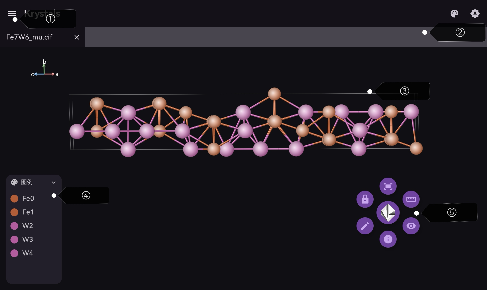
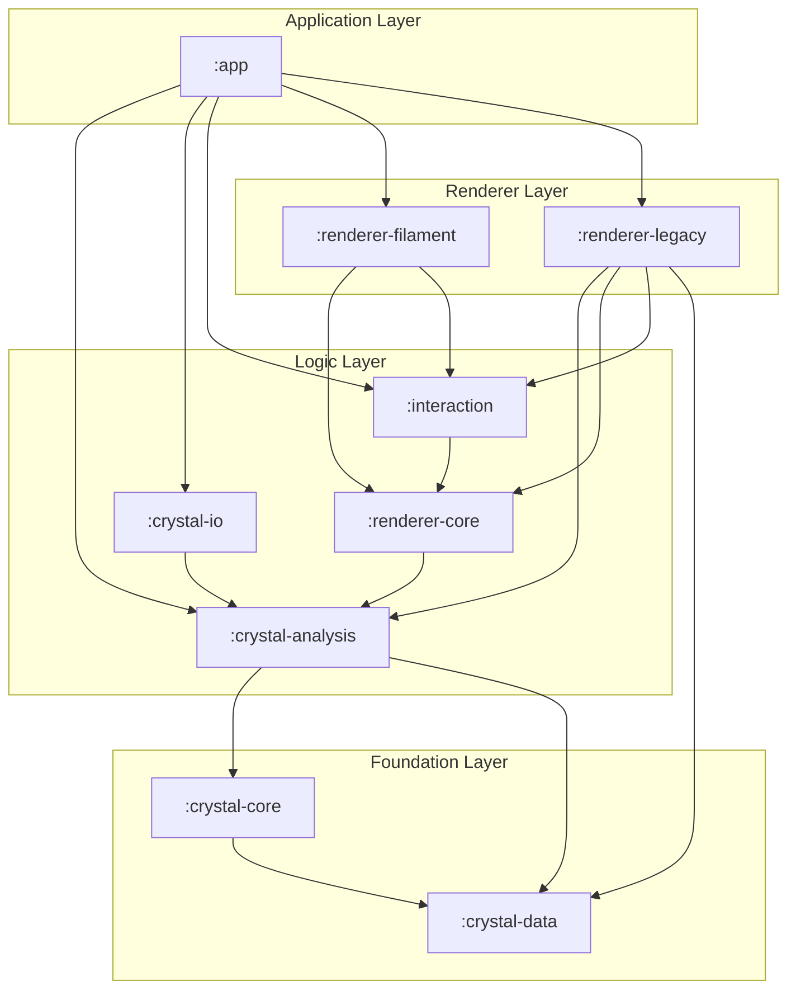

# Krystals

  

<h3 align="center"> Krystals: Android 平台轻量化 CIF 晶体编辑器 </h3>
  <p align="center">
    像 vesta 一样在移动平台便捷地查看晶体！
    <br />
    <a href="https://github.com/SUPERkelesss/Krystals/releases"> <strong> 下载发行包 </strong> </a> ·
    <a href="https://github.com/SUPERkelesss/Krystals/issues"> 报告 Bug </a>
  </p>


---

## 如何安装？

进入该项目的 [Release 页面](https://github.com/SUPERkelesss/Krystals/releases) ，下载最新安装包并安装即可。

## 快速上手

主界面内提供了四种方式导入 CIF 文件：

- **导入本地文件**：从文件管理器选择 CIF 文件并打开。
- **从预设中导入**：软件提供了丰富的预设资源包，涵盖大部分基础 CIF 测试。您也可以将自己的 CIF 文件保存在预设中。
- **从在线源导入**：提供了从 [Crystallography Open Database](https://qiserver.ugr.es/cod/index.php) 中导入和从 [Materials Project](https://next-gen.materialsproject.org/) 中导入两种选择，其中后者需要 apikey，属于高级功能，需要赞助后使用激活码解锁。前者使用不受限制。
- **创建新文件**：从空文件开始创建 CIF 文档。

**软件主界面**：



- ① 菜单选项，包含文件新建和保存操作；
- ② 更改整体外观配置于调节明暗主题；
- ③ viewer 主界面
  - 单指拖动可旋转晶体，双指拖动可缩放和平移晶体；
  - 双击原子将显示原子信息，点按原子信息窗即可锁定该信息窗。
- ④ 图例
- ⑤ 常用操作悬浮球
  - **对齐**：将晶体视图对齐到某一轴向；
  - **锁定**：固定晶胞视图不变；
  - **测量**：进入测量模式，选择测量长度和角度数据。单击测量信息窗可锁定；
  - **编辑**：进入编辑页面，修改晶胞数据，原子坐标和化学键规则；
  - **显示**：进入显示页面，调节原子，化学键和配位多面体可见性；
  - **信息**：显示晶体信息窗。

---

## 架构图



---

### 构建安装包

主要依赖的环境：

- Android Studio with Android SDK 36
- Kotlin 2.1.21
- JDK 17
- Gradle 8.11.1
- Google Filament 1.71.5
- OkHttp 4.12.0

只需运行该脚本文件，即可下载所需环境并配置安装包：

```pwsh
.\scripts\bootstrap-build.ps1
```

构建输出的 APK 文件位于 `app/build/outputs/apk`。

软件提供的测试命令：

```
```

## 贡献者

- [SUPERkelesss (kelesss)](https://github.com/SUPERkelesss)

## 版权说明

本项目遵循 [MIT 协议许可](LICENSE)。

## 鸣谢


- 项目使用的 AI 模型：Openai ChatGPT-5.6-sol & Kimi-k3 & glm-5.2
- [kunoyo-Galactose](https://github.com/kunoyo-Galactose)
