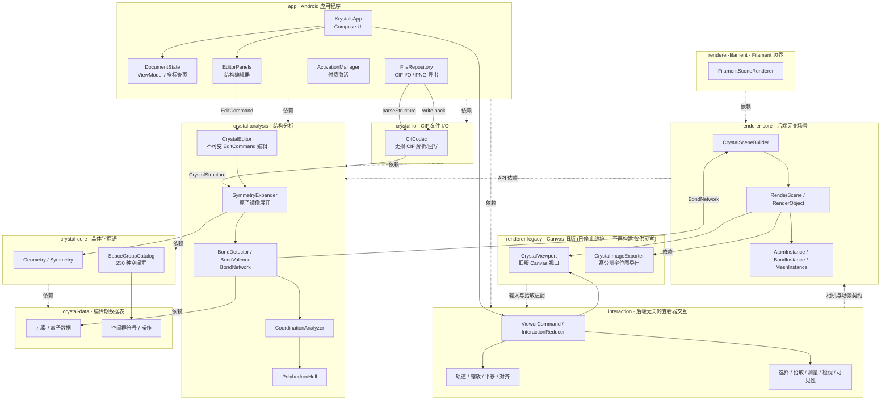

# Krystals


<h3 align="center"> Krystals：一款轻量级 Android CIF 晶体编辑器 </h3>
  <p align="center">
    在手机上像 VESTA 一样方便地查看晶体！
    <br />
    <a href="https://github.com/SUPERkelesss/Krystals/releases"> <strong> 下载发行版 </strong> </a> ·
    <a href="https://github.com/SUPERkelesss/Krystals/issues"> 报告 Bug </a> · 
    <a href="README.md"> English README </a> 
  </p>


---

## 如何安装？

前往项目的 [Release 页面](https://github.com/SUPERkelesss/Krystals/releases)，下载最新安装包并安装。

## 快速开始

主界面提供四种导入 CIF 文件的方式：

- **导入本地文件**：从文件管理器中选择 CIF 文件并打开。
- **从预设导入**：App 提供了丰富的预设库，涵盖大部分基础 CIF 测试用例。你也可以将自己的 CIF 文件保存到预设库中。
- **从在线源导入**：提供两种方式——从 [Crystallography Open Database](https://qiserver.ugr.es/cod/index.php) 导入和从 [Materials Project](https://next-gen.materialsproject.org/) 导入。后者需要 API 密钥，是赞助后通过激活码解锁的高级功能。前者无使用限制。
- **新建文件**：从空文件开始创建 CIF 文档。

**主界面**：


- ① 菜单选项，包括文件创建和保存操作；
- ② 更改整体外观设置，切换明暗主题；
- ③ 查看器主屏幕
  - 单指拖拽旋转晶体，双指拖拽缩放和平移晶体；
  - 双击原子显示其信息；点击原子信息窗口可将其锁定。
- ④ 图例
- ⑤ 快捷操作悬浮球
  - **对齐**：将晶体视图对齐到指定晶轴；
  - **锁定**：固定晶胞视图使其保持不变；
  - **测量**：进入测量模式，测量长度和角度。点击测量信息窗口可将其锁定；
  - **编辑**：进入编辑器页面，修改晶胞数据、原子坐标和化学键规则；
  - **显示**：进入显示页面，调整原子、化学键和配位多面体的可见性；
  - **信息**：显示晶体信息窗口。

---

## 架构图



---

### 构建包

所需环境：

- Android Studio，含 Android SDK 36
- JDK 17
- Gradle

运行以下脚本下载所需环境并配置构建：

```pwsh
.\scripts\bootstrap-build.ps1
```

Debug APK 位于 `app/build/outputs/apk/debug/app-debug.apk`。

## 贡献者

暂无……

## 许可证

本项目基于 [MIT 许可证](LICENSE) 发布。

## 鸣谢


- Openai ChatGPT 5.6 sol
- Kimi k3
